Obligatorio DevOps

Diagrama de Solución

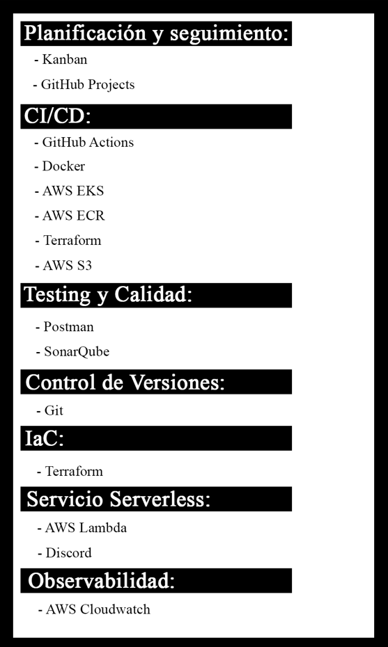

Metodología utilizadas:

1. Planificación y Seguimiento 

Para la planificación y el seguimiento del obligatorio se implementó la metodología ágil Kanban, la cual permite visualizar el flujo de trabajo, priorizar tareas y mantener una mejora continua en la gestión del equipo.

En nuestro caso, utilizamos un tablero Kanban en GitHub Projects, donde organizamos y controlamos las tareas del equipo. Este tablero se encuentra dividido en las siguientes columnas, que representan los distintos estados del trabajo:

* To Do (Por hacer): aquí registramos todas las tareas pendientes que aún no fueron iniciadas.  

* In Progress (En progreso): en esta columna se ubican las tareas que están siendo desarrolladas actualmente.  

* Done (Hecho): finalmente, en esta columna se mueven las tareas completadas y aprobadas por el equipo.  

De esta forma, el tablero Kanban nos permite visualizar el estado de avance del proyecto en tiempo real, identificar posibles bloqueos y mantener una comunicación fluida entre los miembros del equipo.  

Screenshots de evolución del flujo de trabajo:

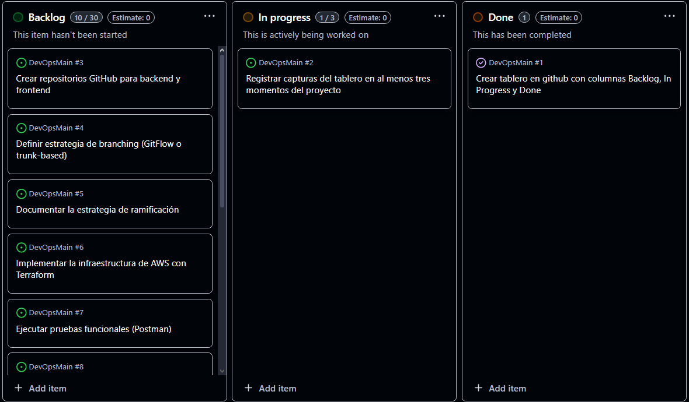

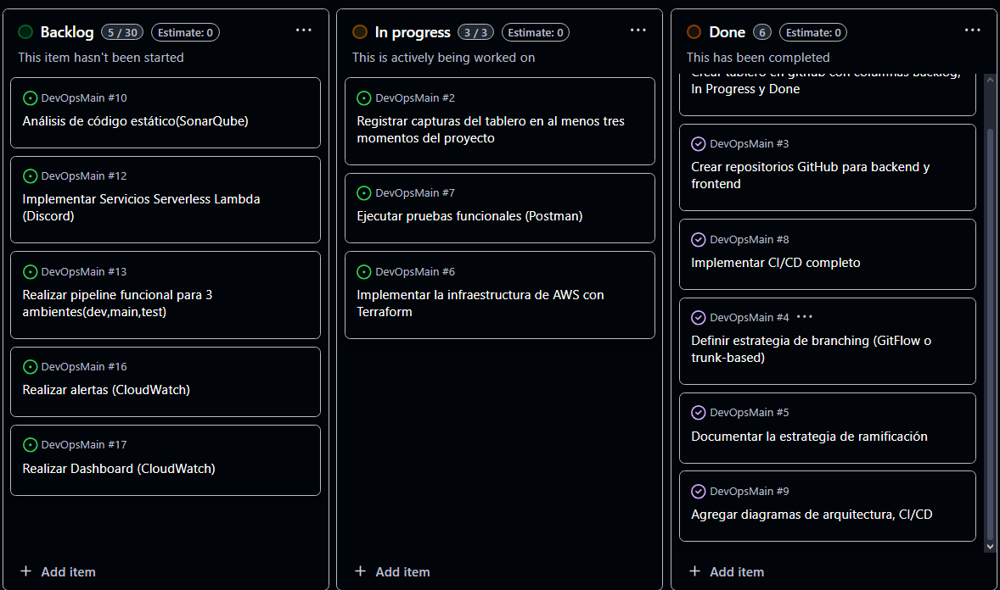

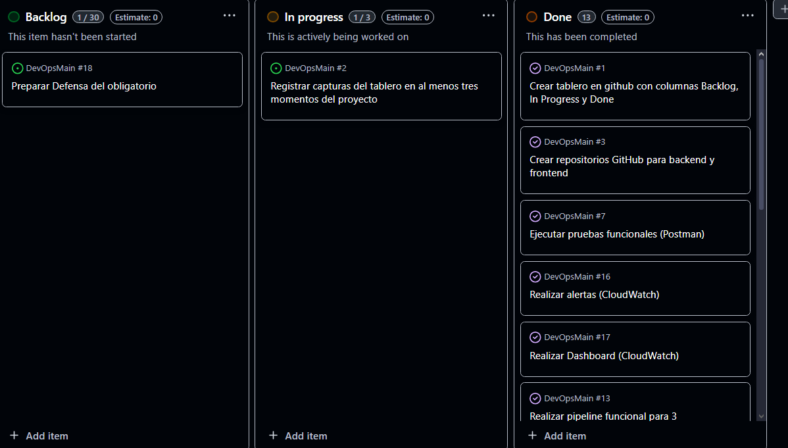

2. Estrategia de ramificación 

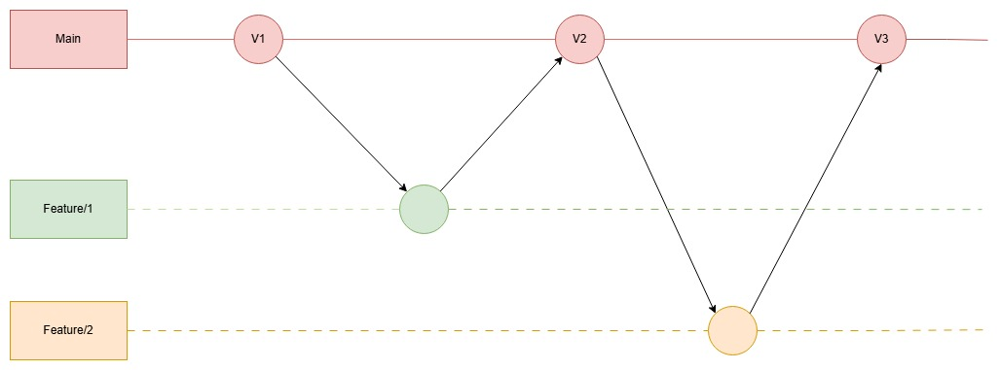

El diagrama ilustra de manera visual el flujo de trabajo que seguimos para gestionar el código utilizando una variante simplificada de Git Flow, enfocada en mantener un desarrollo ordenado, controlado y fácilmente rastreable.

En esta estrategia, la rama main actúa como la línea base del proyecto, donde se mantienen las versiones estables del software. Cada punto marcado como V1, V2 y V3 representa una versión liberada o un hito importante dentro del desarrollo. Estas versiones solo se generan cuando el código ha sido completamente integrado y validado.

A partir de la rama principal, se crean ramas feature/ destinadas al desarrollo de nuevas funcionalidades. En el diagrama se observa cómo cada funcionalidad se desarrolla de manera aislada en su propia rama (feature/1 y feature/2). Esta separación permite trabajar en paralelo sin interferir con el código estable.

Una vez completada la funcionalidad, la rama feature se integra nuevamente en main mediante un merge. Esto se representa con las flechas ascendentes hacia los puntos de versión posteriores. Así, por ejemplo, una funcionalidad desarrollada en feature/1 contribuye a la creación de la versión V2, mientras que otra desarrollada en feature/2 se integra en la versión V3.

Justificación de la estrategia de ramificación elegida

Se eligió esta estrategia de ramificación porque permite mantener un desarrollo ordenado y predecible sin agregar complejidad innecesaria. Al trabajar con ramas feature separadas de la rama main, el equipo puede desarrollar nuevas funcionalidades de forma aislada, evitando conflictos y asegurando que el código estable nunca se vea afectado.

Además, integrar cada feature únicamente cuando está completa y validada ayuda a garantizar que las versiones liberadas sean consistentes, estables y fáciles de rastrear.
Esta variante simplificada de Git Flow ofrece el equilibrio justo entre organización, control y agilidad, adaptándose muy bien al tamaño del equipo y a las necesidades del proyecto.

3. Testing y Calidad 

#### Pruebas funcionales (Postman)

Se realizaron pruebas funcionales directamente en el pipeline de CI/CD para asegurar que las distintas etapas del flujo de trabajo funcionen correctamente. Estas pruebas permiten verificar que los endpoints y la lógica de la aplicación se ejecuten como se espera antes de desplegar.

Resultado de las pruebas en el pipeline:

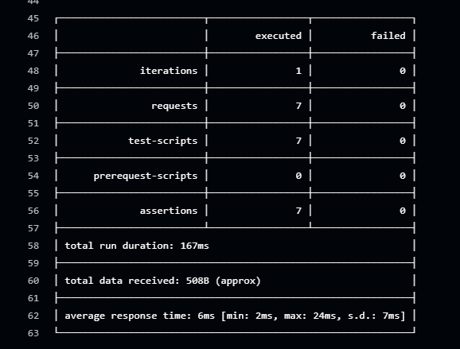

Análisis de Código Estático(SonarQube)

Durante el análisis realizado en SonarQube se identificaron varios puntos críticos relacionados con la calidad, seguridad y mantenibilidad del código en los distintos proyectos del repositorio. A continuación, se resumen los aspectos más relevantes.

### Hallazgos Importantes

* El proyecto DevOpsMain presenta un estado Failed y concentra una cantidad significativa de problemas, incluyendo 16 issues de seguridad, 15 issues de confiabilidad y 29 code smells. Además, no cuenta con ningún nivel de cobertura de pruebas, lo cual representa un riesgo elevado en términos de estabilidad y calidad.  

* En DevOpsInventory-Service se detectaron 2 issues de seguridad, 4 issues de confiabilidad, 16 code smells y un porcentaje de duplicación del 8.8%, considerado alto para su tamaño.  

* El proyecto DevOpsFront presenta 16 issues de confiabilidad y 29 code smells, reflejando problemas de mantenibilidad y potenciales fallos futuros.  

* En DevOpsProduct-Service se identificó un issue de seguridad y la ausencia de revisión en los hotspots detectados.  

* A nivel general, se observa una tendencia común de alta cantidad de code smells, falta de cobertura de pruebas y ausencia de revisión de hotspots en varios de los proyectos analizados.  

### Mejoras Importantes

* Priorizar la corrección de los issues de seguridad en todos los servicios, especialmente en DevOpsMain y DevOpsInventory-Service, por su impacto directo en la integridad del sistema.  

* Implementar y ampliar el uso de pruebas unitarias, con el objetivo de incrementar significativamente la cobertura, particularmente en DevOpsMain, donde actualmente es inexistente.  

* Reducir el nivel de duplicación de código presente en Inventory-Service mediante la refactorización y reutilización de componentes y funciones comunes.  

* Abordar la disminución de los code smells en DevOpsFront y DevOpsMain para mejorar la mantenibilidad general del código.  

* Completar la revisión de hotspots de seguridad en los proyectos donde aún no se ha realizado, como DevOpsInventory-Service y DevOpsProduct-Service.  

* Revisar y corregir la configuración del análisis en DevOpsMain, de forma que permita ejecutar el proceso de evaluación sin errores.

### Justificación sobre la Integración en el Pipeline

No se consideró necesario añadir estos controles directamente dentro del pipeline de CI/CD, dado que se implementaron Quality Gates a través de SonarCloud. Estos Quality Gates permiten evaluar automáticamente la calidad del código, bloquear despliegues en caso de incumplimiento y centralizar todas las métricas esenciales de seguridad, mantenimiento y confiabilidad en un único sistema de auditoría continua.

Capturas dentro de SonarQube:

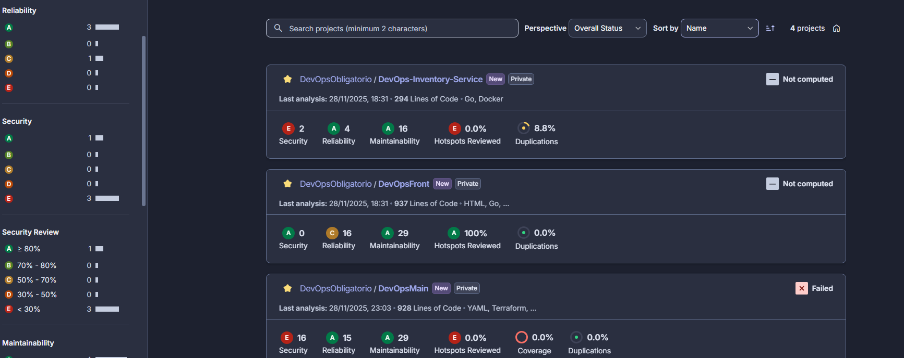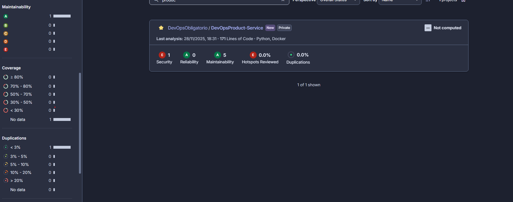

4. Infraestructura como Código(Iac)

Se generó toda la infraestructura necesaria para los tres entornos del proyecto (dev, test y main) utilizando Terraform.

Mediante el uso de terraform.workspace, se logró que la misma configuración declare y despliegue automáticamente los recursos apropiados para cada ambiente, evitando duplicar código y manteniendo una infraestructura consistente y fácil de mantener.

Con este enfoque, cada entorno cuenta con su propio conjunto aislado de recursos (EKS, dashboards, alertas, Lambda, etc.), permitiendo realizar pruebas y despliegues de manera independiente sin afectar a los demás ambientes.

Pruebas:

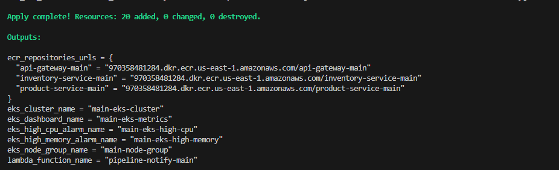

5. Control de Versiones

Para el control de versiones del proyecto se utilizó Git, permitiendo gestionar los cambios del código de forma segura, colaborativa y trazable. Además, se empleó GitHub como plataforma centralizada para alojar los repositorios, gestionar pull requests, revisar código y coordinar el flujo de trabajo entre equipos.

Nuestra solución se estructuró dentro de una organización de GitHub, diseñada para separar responsabilidades y facilitar el mantenimiento, escalabilidad e independencia de cada servicio. Esta organización está compuesta por cuatro repositorios, cada uno enfocado en un componente específico del sistema:

* DevOpsMain:  
 Contiene la infraestructura como código (IaC), automatizaciones, pipelines, Terraform, configuración de entornos y todos los recursos necesarios para desplegar y gestionar los ambientes dev, test y main.  

* DevOps-Inventory-Service:  
 Servicio backend responsable de la lógica relacionada al inventario. Está desarrollado en Go.  

* DevOpsProduct-Service:  
 Microservicio backend encargado de la gestión de productos. Desarrollado en Python.  

* DevOpsFront:  
 Repositorio del frontend de la aplicación. Contiene la UI.

6. Servicios Serverless

Se implementó una función Lambda que se integra en el pipeline de CI/CD para notificar automáticamente cuando el pipeline finaliza. Esta función envía alertas al canal de Discord configurado, permitiendo al equipo recibir notificaciones en tiempo real sobre el estado de la ejecución.

Resultado de las pruebas:

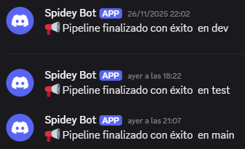

7. Observabilidad – Dashboard y Alertas en CloudWatch

Se implementó un dashboard en AWS CloudWatch que permite monitorear métricas críticas del clúster EKS, asegurando visibilidad sobre el estado y rendimiento de los recursos. El dashboard incluye gráficos para:

* Uso de CPU y memoria de pods y nodos.  

* Estado de pods y nodos, incluyendo pods pendientes, nodos fallidos y pods en ejecución.  

* Rendimiento del API Server, con métricas de errores 4XX/5XX y latencias P99.  

* Tráfico de red y almacenamiento, mostrando bytes transmitidos y recibidos.

Además se configuraron dos alertas críticas utilizando CloudWatch Alarms y SNS, y para facilitar las pruebas, se definieron thresholds muy bajos:

1. Alerta de CPU alta: Se dispara cuando el uso promedio de CPU de los pods supera el 2%.  

2. Alerta de memoria alta: Se dispara cuando el uso promedio de memoria de los pods supera el 2%.  

Estas alertas están suscritas a una función Lambda, que envía notificaciones al canal de Discord, permitiendo al equipo recibir avisos en tiempo real sobre condiciones relevantes en el clúster.

Pruebas:

Dashboard:

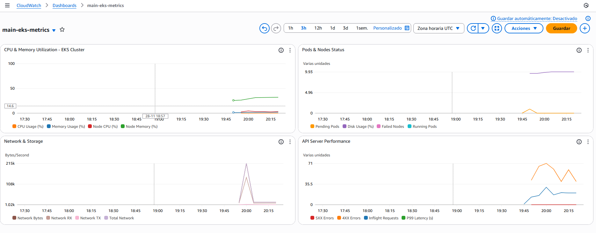

Alerta Cpu:

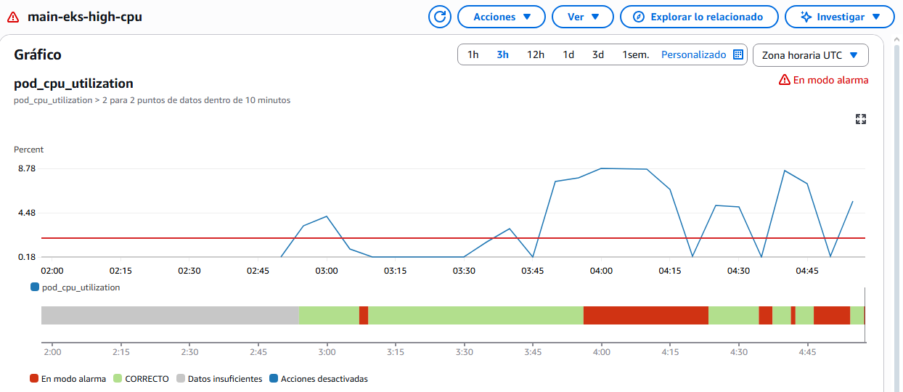

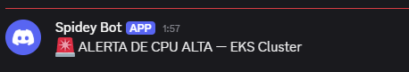

Alerta Memoria :

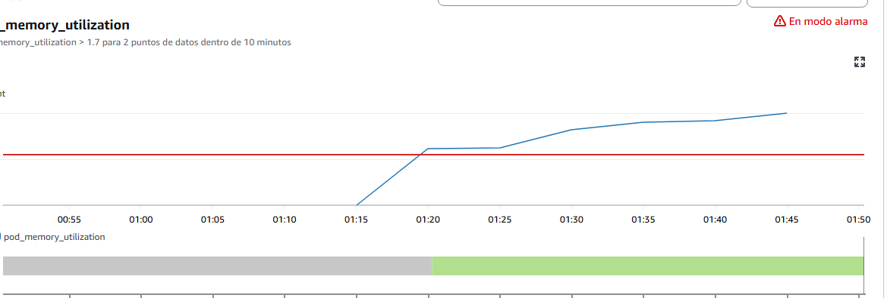

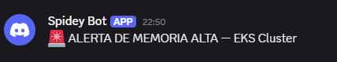

8. GitHub Actions:

Para automatizar todo el flujo de desarrollo y despliegue de la aplicación, implementamos un sistema CI/CD completo utilizando GitHub Actions. La solución está organizada con cuatro pipelines principales, separados por CI y CD, tanto para el backend como para el frontend.

Pipelines de Integración Continua (CI)

1. CI Backend  

* Ejecuta pruebas, validaciones y el build del backend.  

* Levanta un entorno de testing con Docker Compose para los microservicios Product e Inventory.  

* Corre pruebas funcionales con Newman (Postman).  

* Si todo pasa correctamente, construye las imágenes Docker y las publica en Amazon ECR según el entorno (main, dev o test).  

2. CI Frontend  

* Clona el proyecto del frontend.  

* Corre análisis de calidad con SonarCloud.  

* Construye la imagen Docker del frontend y la publica en Amazon ECR diferenciada por entorno.  

Ambos CI se ejecutan automáticamente al hacer push a las ramas:  
 main, dev y test.

### Pipelines de Despliegue Continuo (CD)

Los pipelines de CD se ejecutan únicamente si su CI correspondiente terminó exitosamente.

3. CD Backend  

* Detecta automáticamente el entorno en el que debe desplegar (main, dev o test).  

* Configura AWS y se conecta al clúster EKS del entorno.  

* Reemplaza las variables necesarias en los manifests de Kubernetes.  

* Aplica los deployments de Redis, Postgres, Product Service e Inventory Service.  

* Envía una notificación mediante una Lambda indicando que el despliegue terminó correctamente.  

4. CD Frontend  

* Funciona igual que el CD Backend, pero aplicando los manifests del frontend (API Gateway).  

* Notifica también al finalizar usando la Lambda del entorno.

Pruebas de Ejecución del Pipeline:

Pruebas de que la aplicación es accesible desde internet:

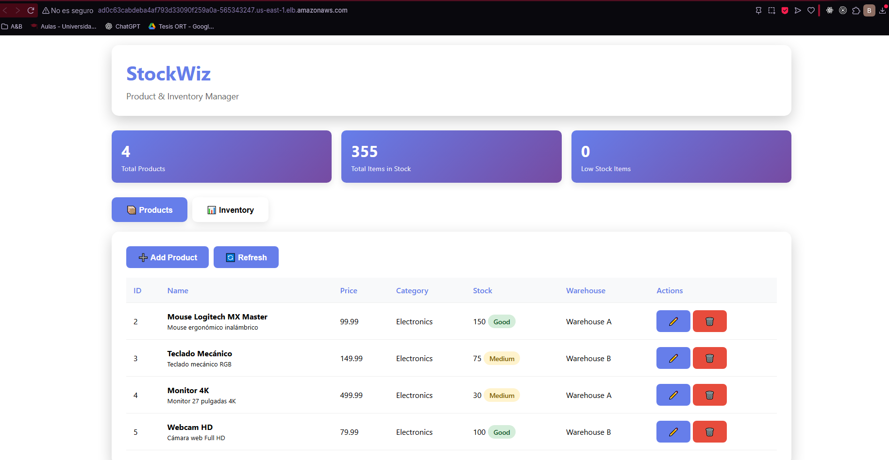

### Justificación del uso de herramientas de IA

Durante el desarrollo del entregable se utilizaron herramientas de Inteligencia Artificial como apoyo para mejorar la claridad, redacción y presentación del documento. Su uso se limitó exclusivamente a tareas de asistencia, tales como:

- Reformular textos para obtener explicaciones más claras y concisas.
- Corregir estructuras gramaticales o de estilo.
- Generar descripciones más ordenadas a partir de ideas ya definidas por el equipo.
- Convertir formatos (por ejemplo, HTML a Markdown) de forma más eficiente.

Es importante destacar que **todas las decisiones técnicas, configuraciones, diagramas, implementaciones y resultados del proyecto fueron realizados manualmente por el equipo**.  
La IA funcionó únicamente como una herramienta de apoyo documental, sin intervenir en la elaboración de la solución técnica ni en la toma de decisiones del proyecto.
